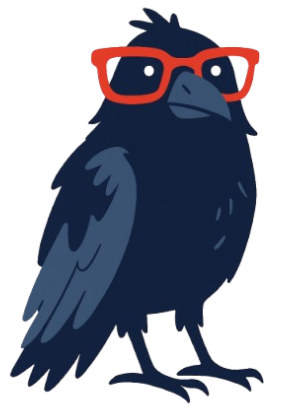

# Frontend Cuervos 🦅 

Aplicación web plataforma de video online. Desarrollada con React.js y Vite, diseñada para ofrecer servicio de video a poblacion con dificultades de acceso.



---

## 🚀 Características Principales

### Interfaz de Usuario
- Diseño responsive con Bootstrap Mentor
- Navegación fluida con React Router
- Animaciones con Framer Motion
- Tema claro

### Integraciones
- Conexión con API's (Video_Service, Login_backend_cuervos, Questionary_Service, TestingService)
- Autenticación JWT
- WebSockets para actualizaciones en tiempo real

### Rendimiento
- Carga optimizada con Vite
- Code splitting automático
- Pre-rendering de rutas críticas

---

## 🛠 Stack Tecnológico

### Frontend
- **React 18** (Hooks API)
- **Vite** (Bundler y servidor)
- **Mentor** (Estilos)
- **React Router v6** (Navegación)

### Herramientas
- **ESLint + Prettier** (Calidad de código)
- **Husky** (Git hooks)
- **Jest + Testing Library** (Pruebas unitarias)

---

## 📦 Instalación

Requisitos previos:
- Node.js v18+
- npm v9+ o yarn

---

## Clonar repositorio
```bash
git clone https://github.com/Cuervo-s-Projects/Frontend_cuervos.git
cd Frontend_cuervos
```
---

## Instalar dependencias
```bash
npm install
```

---

## Iniciar servidor de desarrollo
```bash
npm run dev
```

---

## ⚙️ Configuración
VITE_API_URL=http://localhost:5000/api
VITE_APP_TITLE="Frontend Cuervos"
VITE_DEBUG_MODE=false

---

## 🏗 Estructura del Proyecto


---

## 📬 Contacto
- Jacel Thomás Enciso Pinzón - [@slendrac123](https://github.com/slendrac123) - Correo: jencisop@unal.edu.co
- Daniel Santiago Delgado Pinilla - [@ddelgadopi](https://github.com/ddelgadopi) - Correo: ddelgadopi@unal.edu.co
- Juan David Ramírez López - [@Juramirezlop](https://github.com/Juramirezlop) - Correo: juramirezlop@unal.edu.co
- Jesus David Giraldo Gomez - [@gdavidg-27](https://github.com/gdavidg-27) - Correo: jedgiraldogo@unal.edu.co
- Cristian Liu Chois Amaya - [@cchois](https://github.com/cchois) - Correo: cchois@unal.edu.co
- Iván David Molina Leguízamo - [@ivdmolinale](https://gitlab.com/ivdmolinale) - Correo: ivdmolinale@unal.edu.co

Proyecto: [https://github.com/Cuervo-s-Projects/Frontend_cuervos](https://github.com/Cuervo-s-Projects/Frontend_cuervos)

---
